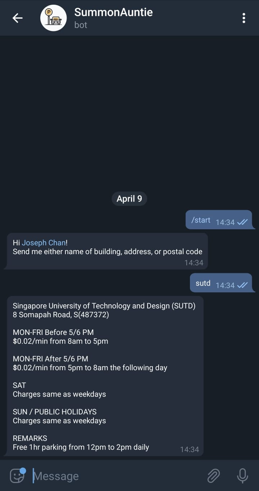

## Singapore Telegram Parking Bot

Link to Telegram Bot: https://t.me/SGSummonBot

### Usage:

- Simply send it any building name and it will return to you the parking rate. 
- It can also take in a 6-digit postal code

### Miscellaneous Information

- Data is scraped from sgcarmart: https://www.sgcarmart.com/news/carpark_index.php?LOC=sm&TYP=carpark
- Scraping script is not included
- SGCarMart does not store HDB Carpark rates because well, thats standardized island wide. 
- Does not contain all the carparks in singapore but contains many of the popular ones. The attached CSV file contains all the carparks in the database.
